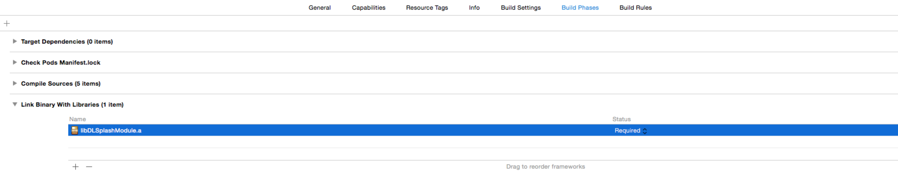
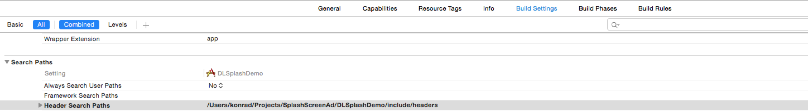

# Sponsoring Banner Module - Tutorial iOS

## Goal
Create a component that can show application sponsor banner which can be used in various applications.

## Installation
DLSponsoringBannerModule can be installed in two ways. Manually copying files into project or by using CocoaPods.

### Manually installation
You need to simply copy the files of DLSponsoringBannerModule (libDLSponsoringBannerModule.a and .h files) to you xcode project.

Next go to your project setting, select given target and then Build Phases tab. Under the "Link Binary With Libraries" section add `libDLSponsoringBannerModule.a` file.



Then in the same target settings in the "Build Settings" tab search for "Header Search Paths" and add path to the headers of DLSponsoringBannerModule in your project.



### Via CocoaPods
In order to install it as a pod you need to specify the source of internal pods. Add this source to your Podfile so it will be possible to find Podfile:

```
source 'https://source-of-dlsponsoringbannermodule.pl'
```

In your Podfile add the following line:
```
pod 'DLSponsoringBannerModule'
```

## Usage
### Step 1. Initialize
Add #import statement in your AppDelegate:
```
#import <DLSponsoringBannerModule/DLSponsoringBannerModule.h>
```

In application:didFinishLaunchingWithOptions: method of your AppDelegate add following method to initialize `DLSponsoringBannerModule`:
```
[DLSponsoringBannerModule initializeWithSite:<SITE_PARAMETER>];
```
As `<SITE_PARAMETER>` insert your Site Identifier.

### Step 2. Instantiation od `DLSponsoringAdView` for view controller.

Each view controller or other view presenting sponsor banner should use its own instance of `DLSponsoringAdView`. 

In order to get it you only need calling getter with your controller instance as a parameter. To support memory management please keep adView reference as a strong property of your ad parent view. At the same time `DLSponsoringAdView` keeps weak reference to your view.

```
@property (strong, nonatomic) DLSponsoringAdView *adView;

self.adView = [DLSponsoringBannerModule.sharedInstance adViewForParentView:self]
```

It is important your parent view conforms to delegate protocol `DLSponsoringAdViewDelegate` as getter automatically assigns your controller to be delegate of `DLSponsoringAdView`.

```
@interface YourViewcontroller: UIViewController<DLSponsoringAdViewDelegate>
```

### Step 3. Call `DLSponsoringAdView` methods in your view controller's life cycle methods.

It is very important that you call controllerViewWillAppear and controllerViewDidDisappear methods of of `DLSponsoringAdView` in your controller's life cycle methods to let ad view know when to collect view display audit data.

```
- (void)viewWillAppear:(BOOL)animated {
    [super viewWillAppear:animated];

    [self.adView parentViewWillAppear];
}

-(void)viewDidDisappear:(BOOL)animated {
    [super viewWillDisappear:animated];

    [self.adView parentViewDidDisappear];
}
```

### Step 4. Display ad as subview of your ad container 

Whenever ad is ready to be presented `DLSponsoringAdView`'s isReady (ad data and image are already in local cache) flag returns positive value. It is required that you check this flag always when your view controller (or e.g. UITableViewCell containing ad) is presented for the first time in order layout your ad synchronously together with all of your views. You can also use adSize flag to check with which size ad should be presented on screen.

```
if (self.adView.isAdReady) {
    CGSize size = self.adView.adSize;
    // Add DLSponsoringAdView as subview of your view.
    // You can here either update frame of adView or setup layout constraints in a wished way.
    // e.g. self.adView.frame = CGRectMake(0, 0, size.width, size.height)
}

```

### Step 5. Implement delegate methods
You need to implement methods of `DLSponsoringAdViewDelegate` to be notified and react on events

```
// Method is called when user taps on the DLSponsoringAdView. You need to open given URL in your application's web view.
- (void)adView:(DLSponsoringAdView *)adView didTapImageWithUrl:(NSURL *)url;
```

```
// Method called whenever sponsoring banner ad presented by your controller needs to be reloaded adapting to new ad size.
// It happens always when there is newly reveived ad ready to be displayed on the screen.
// It always returns ad for which isAdReady flag has positive value.
// Whenever isAdReady returned with false in Step 4 implementation, it may happen that you would require displaying your DLSponsoringAdView as a result of this method.
// You can either use NSLayoutConstraint relations as DLSponsoringAdView resizes itself accordingly (see Demo application) or adapt size on your own.
- (void)adViewNeedsToBeReloaded:(DLSponsoringAdView *)adView withExpectedSize:(CGSize)size;
```

## Implementation details

The main three classes that developer is tinkering with are: `DLSponsoringBannerModule`, `DLSponsoringAdView` and `DLSponsoringAdViewDelegate`.


`DLSponsoringAdView` is a subclass of UIView to display the image of the ad. 

Process of downloading an ad is started when `+initializeWithSite` on `DLSponsoringBannerModule` is invoked. Downloading is finished when all date is fetched or when the timeout is reached.

DLSponsoringBannerModule persiste cache for banner json in NSUserDefaults and image on disk within app sandbox.


DLSponsoringBannerModule after fetching ad json data compares it to cached json data. When ad version is different then a new ad image is being downloaded.
If the ad version is the same then the cached ad image is being used. But if the version is the same but there is no cached ad image then an ad image is being downloaded.


Developer can create class that conforms to `DLSponsoringAdViewDelegate` and is delegate of `DLSponsoringAdView`. `DLSponsoringAdView` informs its delegate if user tapped on image and ad should be reloaded with new size. 

Sponsoring Banner module waits 3 seconds to fetch ad data and to display it.
When it fetched ad data and image withing that time then ad is displayed for the time fetched in ad data.

Fetching ad data and image will be continued in background when timeout was reached.

Fetching is being retried 3 times when failed.
